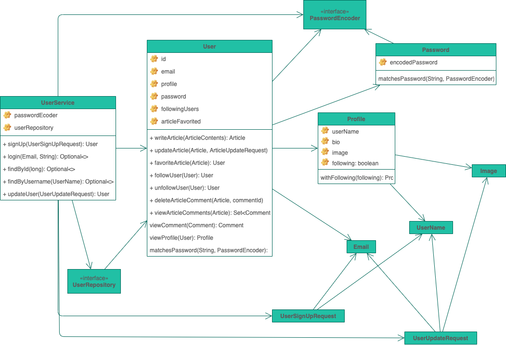
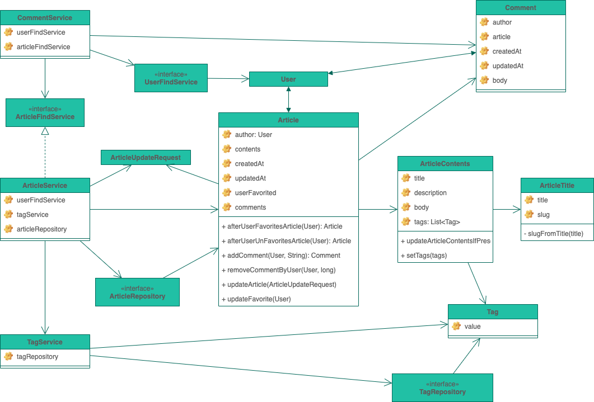
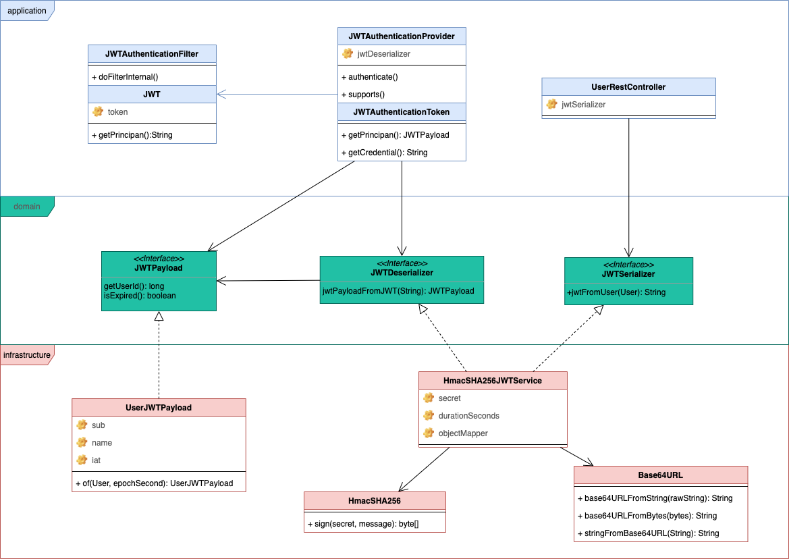
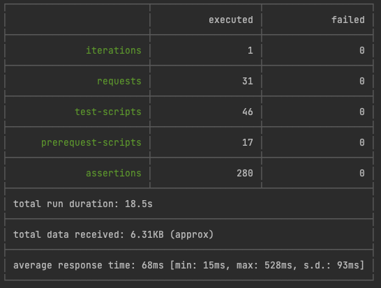

# Overview

## Design Principal

- Always `final` whenever possible
- Always package private class whenever possible
- **Always test every package, class, method, instruction in codes**
  - Except for some boilerplate `equals` and `hashcode` method
  - This is validated by [jacoco-gradle-plugin](https://docs.gradle.org/current/userguide/jacoco_plugin.html).
  - Coverage verification in [`./test.gradle`](./test.gradle)
- Try to avoid including additional dependencies as much as possible
  - Implements JWT generation / validation logic without 3rd party library [#3](https://github.com/raeperd/realworld-springboot-java/issues/3)
- Try to maintain codes in domain package remain POJO
  - Except for special spring annotations like `@Service`, `@Repository`, `@Transactional`
  - Prohibit use of lombok in domain package
- Try to follow all modern best practices for spring-boot project
  
## Diagrams 

- You can open full diagram file in [`realworld.drawio`](./realworld.drawio) using [draw.io](https://app.diagrams.net/)

### User

- Separate password encoding logic out of User.
- User must be created with password encoder.

### Article

- Article contains other elements with `@Embedded` classes
- Try to reduce number of repositories.
- Prefer `@JoinTable` to `@JoinColumn`

### JWT 

- Try not to use 3rd party library
- Serialization and Deserialization are seperated with interfaces
- Domain package contains interface, infrastructure code provide implementation  
- Application package do stuff with spring-security logic

## Performance

- Result of [`./doc/run-api-tests.sh`](./doc/run-api-tests.sh)

# What can be done more

- User class doing so many things now. It can be improved someway.
- Service classes can be divided into smaller services
- Test cases order can be improved
  
# Referenced

